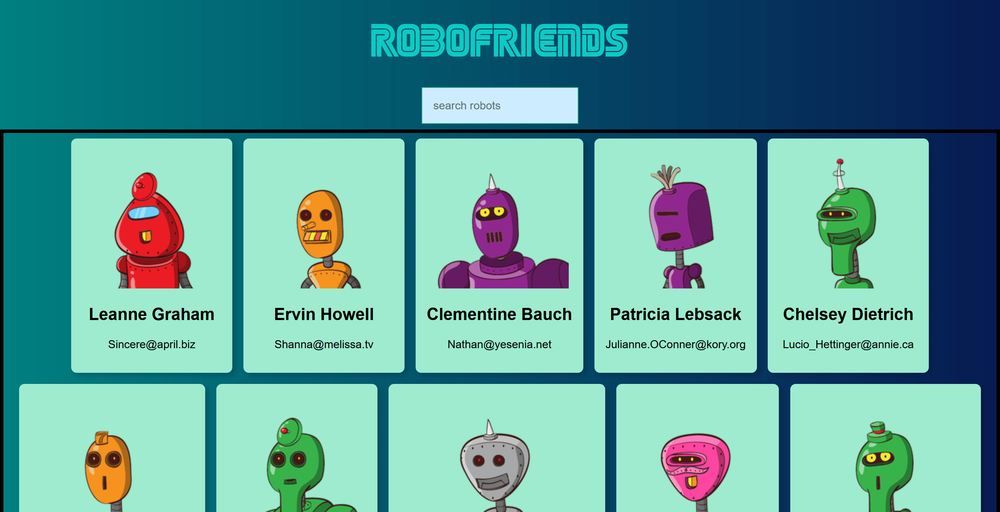

# RoboFriends

[RoboFriends](https://jagaesh.github.io/robofriends) is a fast and responsive React web app that displays a list of robot profiles fetched from an API, with real-time search functionality.

## Preview



## Features

- Real-time search filtering
- Data fetched from [RoboHash API](https://robohash.org/)
- Built with modern React (components, props, state, hooks)
- Simple and responsive UI

## Tech Stack

- React
- JavaScript (ES6+)
- HTML & CSS
- API with [users data](https://jsonplaceholder.typicode.com/users)

## Getting Started

To run the project locally:

```bash
git clone https://github.com/Jagaesh/robofriends.git
cd robofriends
npm install
npm run dev
